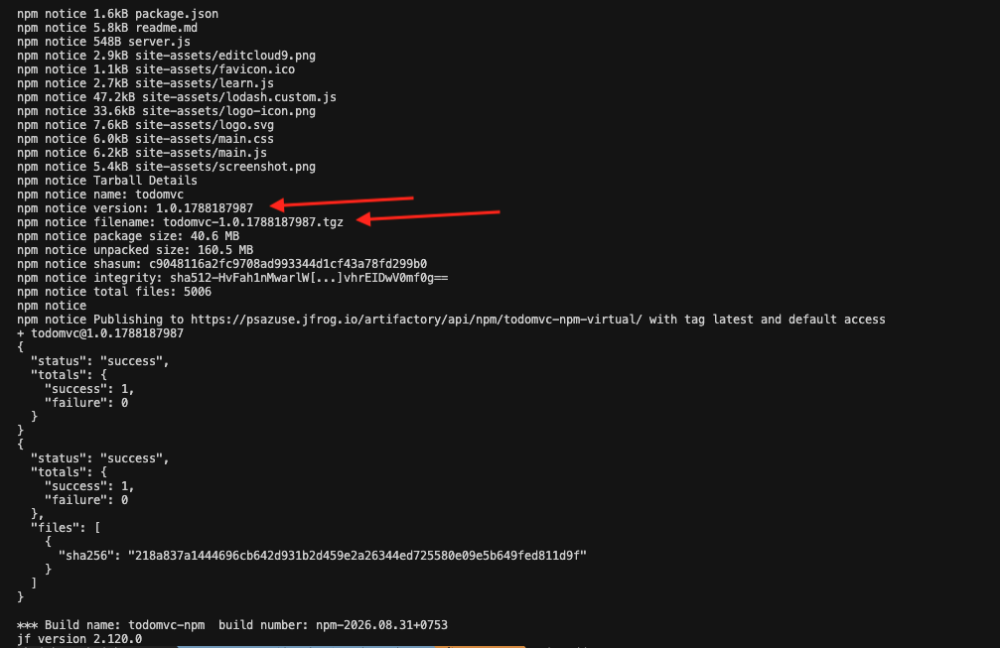
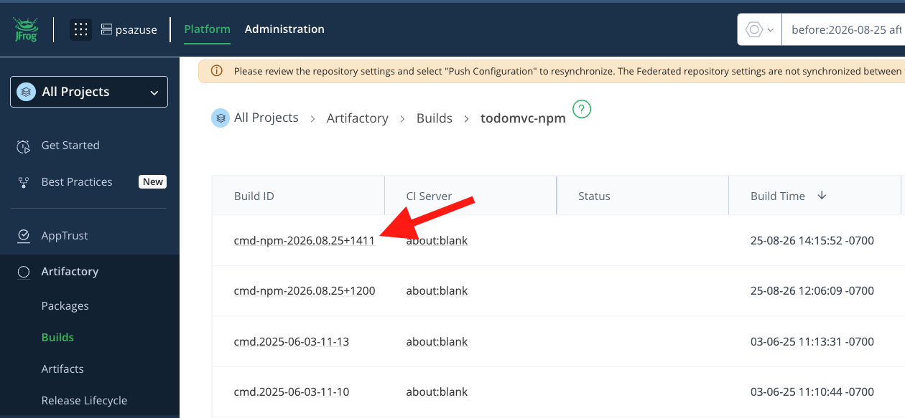
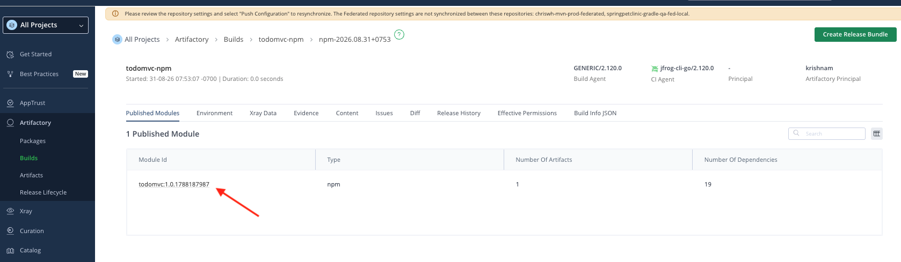
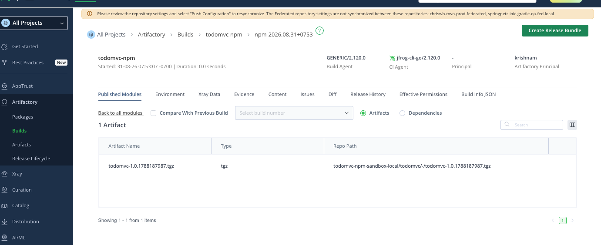
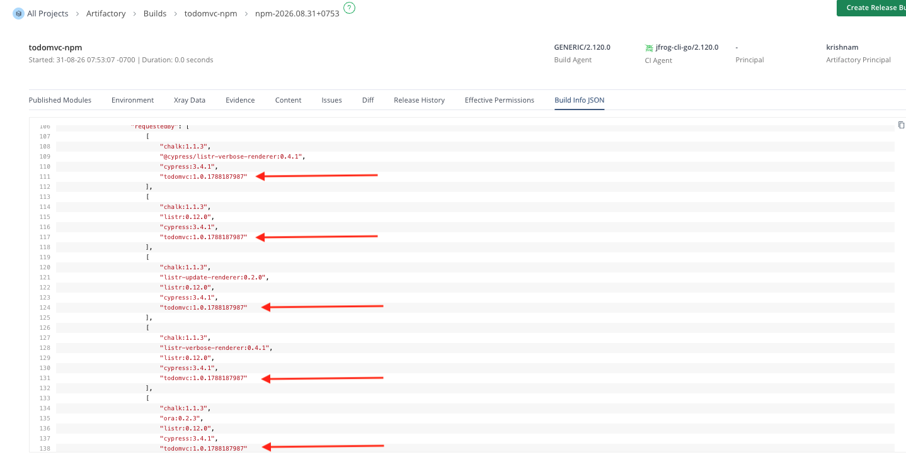
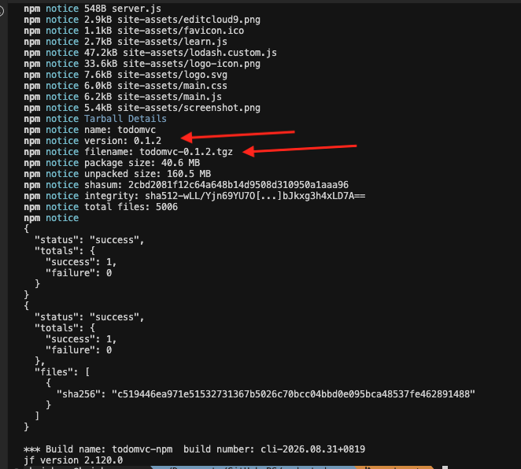
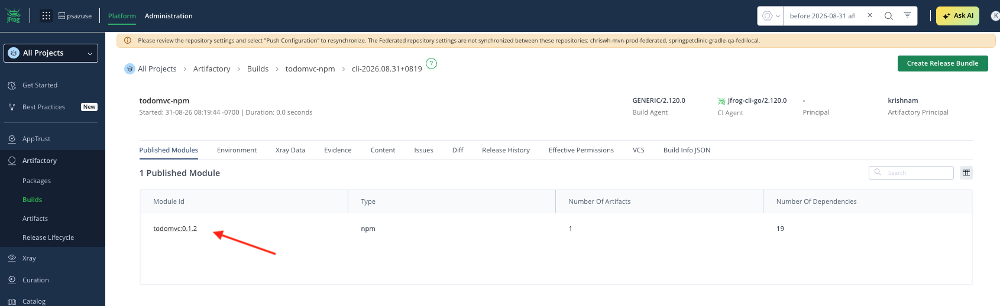
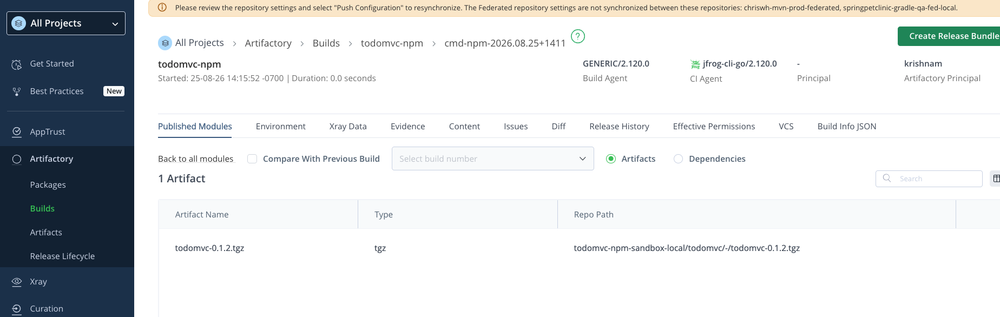

# Node-todomvc

Two ways to publish this npm app with JFrog CLI, and how each published build looks in Artifactory.

Both paths use build name **`todomvc-npm`**, resolve/deploy through virtual repo **`todomvc-npm-virtual`**, and land the tarball in **`todomvc-npm-sandbox-local`**. The difference is how npm is invoked and how the package version is chosen.

| Path | Script | Build ID prefix | Package version |
|------|--------|-----------------|-----------------|
| Native packaging | `./jfcli.sh npm` | `npm-<timestamp>` | `1.0.<epoch>` (stamped for this publish) |
| JFrog CLI npm | `./jfcli.sh cli` | `cli-<timestamp>` | `0.1.2` (from `package.json`) |

`jf rt bp` prints a `buildInfoUiUrl` into the JFrog UI. Examples below are from `jf` **2.120.0**.

---

## Native packaging

```
./jfcli.sh npm
```

Native mode runs stock `npm` through `jf package-alias` (Ghost Frog). Build name/number come from environment variables, not `--build-name` / `--build-number` on the npm commands. The script stamps a unique version (`1.0.<unix-epoch>`) so republish does not collide, then restores `package.json` afterward.

#### References

Refer below for more information about the variables; JFROG_RUN_NATIVE, JFROG_CLI_GHOST_FROG, package-alias

 - https://docs.jfrog.com/artifactory/docs/jfrog-cli-package-alias
 - https://docs.jfrog.com/artifactory/docs/jfrog-cli-package-alias#github-actions-setup 
 - https://docs.jfrog.com/artifactory/docs/native-mode#npm-native-mode

Requires `PSAZUSE_JF_ACCESS_TOKEN`.

### Commands

```
export BUILD_ID="npm-${TIMESTAMP}"
export JFROG_RUN_NATIVE=true
export JFROG_CLI_GHOST_FROG=true
export JFROG_CLI_BUILD_NAME="${BUILD_NAME}"
export JFROG_CLI_BUILD_NUMBER="${BUILD_ID}"

jf package-alias install --packages=npm
npm config set registry "${NPM_REGISTRY}"
npm config set "${NPM_REG_HOST}:_authToken" "${PSAZUSE_JF_ACCESS_TOKEN}"

# Must prepend alias bin to PATH after install so 'npm' resolves to the shim
export PATH="$HOME/.jfrog/package-alias/bin:$PATH"

jf package-alias status

npm version "1.0.${EPOCH}" --no-git-tag-version --allow-same-version
npm install
npm publish

jf rt bp "${BUILD_NAME}" "${BUILD_ID}" --collect-env=true --detailed-summary=true
```

Publishes **`todomvc-npm`** / **`npm-2026.08.31+0753`**. `npm publish` reports `todomvc@1.0.1788187987` and tarball `todomvc-1.0.1788187987.tgz` against `https://psazuse.jfrog.io/artifactory/api/npm/todomvc-npm-virtual/`.




### Artifactory — Builds

**Artifactory → Builds → todomvc-npm**. Native runs use a **`npm-`** Build ID (for example `npm-2026.08.31+0753`). CLI runs on the same page use **`cli-`**.



#### Build details

Open that **Build ID**. **Published Modules** shows module **`todomvc:1.0.1788187987`** (`npm`): 1 artifact, 19 dependencies. CI agent is `jfrog-cli-go/2.120.0`. There is no **VCS** tab on this run (`jf rt bp` did not collect git info).



On that module, switch to **Artifacts**. The tarball is `todomvc-1.0.1788187987.tgz` at:

`todomvc-npm-sandbox-local/todomvc/-/todomvc-1.0.1788187987.tgz`



#### Build Info JSON

The **Build Info JSON** tab is the full published metadata. The module id **`todomvc:1.0.1788187987`** appears both as the published module and throughout the captured dependency lists.



---

## Using JF-CLI

```
./jfcli.sh cli
```

This path uses `jf npmc` plus `jf npm install` / `jf npm publish` with explicit `--build-name` / `--build-number`. The package version stays **`0.1.2`** from `package.json`.

#### References
- https://docs.jfrog.com/artifactory/docs/use-npm-with-jfrog-cli

### Commands

```
export BUILD_ID="cli-${TIMESTAMP}"
jf npmc --repo-resolve ${RT_REPO_NPM_VIRTUAL} --repo-deploy ${RT_REPO_NPM_VIRTUAL}

jf npm install --build-name=${BUILD_NAME} --build-number=${BUILD_ID}
jf npm publish --build-name=${BUILD_NAME} --build-number=${BUILD_ID}

jf rt bp ${BUILD_NAME} ${BUILD_ID} --collect-git-info=true --collect-env=true --detailed-summary=true
```

Publishes **`todomvc-npm`** / **`cli-2026.08.31+0819`**. Publish output shows name `todomvc`, version `0.1.2`, filename `todomvc-0.1.2.tgz`.



### Artifactory — Builds

**Artifactory → Builds → todomvc-npm**. The CLI run is listed as **`cli-2026.08.31+0819`**.


#### Build details

Open that **Build ID**. **Published Modules** shows module **`todomvc:0.1.2`** (`npm`): 1 artifact, 19 dependencies. Because `--collect-git-info=true`, this build also has a **VCS** tab.



On that module, switch to **Artifacts**. The tarball is `todomvc-0.1.2.tgz` at:

`todomvc-npm-sandbox-local/todomvc/-/todomvc-0.1.2.tgz`



#### Build Info JSON

The **Build Info JSON** tab is the full published metadata. The module id **`todomvc:0.1.2`** appears as the published module and throughout the captured dependency lists.


