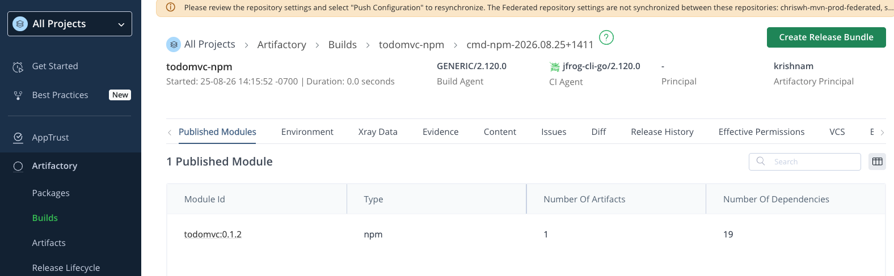
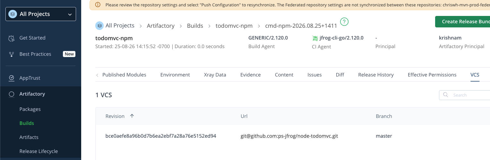
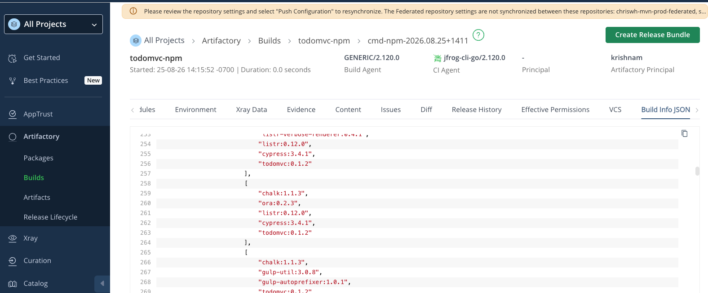

# Node-todomvc

JFrog CLI publish for this npm app, then how the published build looks in Artifactory.

## Build

```
./jfcli.sh
```

Publishes build `todomvc-npm` with a `cmd-npm-<timestamp>` build number and prints a `buildInfoUiUrl` into the JFrog UI.


## Artifactory — Builds

In Artifactory, open **Builds → todomvc-npm**. The new run is listed by **Build ID** (for example `cmd-npm-2026.08.25+1411`).


## Build details

Open that **Build ID**. The **Published Modules** tab shows module `todomvc:0.1.2` (`npm`), with one artifact and captured dependencies.



Switch to **Artifacts** on that module to see the published tarball, for example `todomvc-0.1.2.tgz` under `todomvc-npm-sandbox-local`.


## VCS

The **VCS** tab records the Git revision, remote URL, and branch used when the build was published (`jf rt bag`).



## Build Info JSON

The **Build Info JSON** tab is the full published metadata (modules, artifacts, and dependencies).


